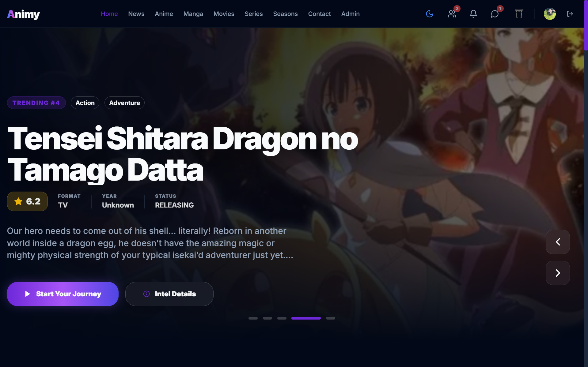

# [PROJECT_NAME] // [TAG_MASTERWORK_V4]

<p align="center">
  
</p>

## THE PHILOSOPHY
> **"Alchemical code for the modern web."**

This is not just a portfolio; it is an **Artistic Archive**. A digital sanctuary designed to push the boundaries of high-performance logic and minimalist aesthetic precision. Every interaction is engineered for visceral resonance, merging the speed of Vite with the soul of WebGL.

---

## THE TECH STACK
<p align="left">
  
  
  
  
  
  
  
</p>

---

## CORE ARCHITECTURE

### 1. Liquid Experience (WebGL)
Integrated **Three.js** shaders with custom warp distortion to create a persistent, organic background layer. Optimized for mobile viewports using dynamic resolution scaling.

### 2. Kinetic Blueprint (Typography)
A reading-focus narrative engine that synchronize text opacity and scale with scroll progress, creating an immersive storytelling flow for the "About Me" segment.

### 3. Experience-Driven Navigation
- **Prismatic Links**: Character-level distortion animations using CSS Filters and SVG Displacement Maps.
- **Magnetic Interaction**: Physical cursor attraction for call-to-action elements, leveraging Spring physics for a "tactile" weight.
- **Horizontal Showcase**: Horizontal scroll-driven project catalog for desktop, transitioning to a vertical optimized stack for mobile.

### 4. Insane Feedback Flow
- **Synthetic Audio**: Real-time "Success" chime generation using the **Web Audio API** (AudioContext), providing immediate confirmation without asset overhead.
- **Masterwork Registry**: A secure transmission system integrated with Formspree for reliable global communication.

---

## SETUP & DEPLOYMENT

### Local Development
```bash
# Clone the archive
git clone https://github.com/Ilyas-Nour/ilyas.git

# Enter the sanctuary
cd ilyas

# Sync dependencies
npm install

# Start the engine
npm run dev
```

### Production Build
```bash
# Optimize for the web
npm run build

# Preview the masterwork
npm run preview
```

---

## LICENSE
**© 2026 Ilyas Nour. All rights reserved.**
Designed and developed with relentless pursuit of the Masterwork standard.

<p align="center">
  <br />
  
</p>
