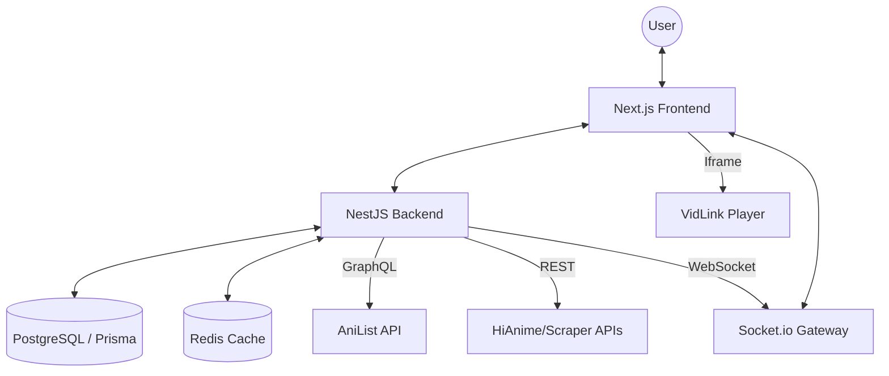

# Animy: Project Documentation & Architecture Overview

## 1. Project Overview
**Animy** is a high-performance, modern anime and manga aggregator platform. It provides users with a seamless experience for discovering, tracking, and streaming anime and reading manga. The project is built with a focus on premium aesthetics, reliability, and real-time social engagement.

---

## 2. Technology Stack

### Backend (anime-aggregator-backend)
- **Framework**: [NestJS](https://nestjs.com/) (Node.js) - Providing a modular and scalable architecture.
- **Language**: TypeScript.
- **Database**: [PostgreSQL](https://www.postgresql.org/) (hosted on [Supabase](https://supabase.com/)).
- **ORM**: [Prisma](https://www.prisma.io/) - For type-safe database access and migrations.
- **Caching**: [Redis](https://redis.io/) (via `cache-manager`) - Used to optimize API performance and reduce external API load.
- **Authentication**: [Passport.js](http://www.passportjs.org/) with JWT, supporting Email/Password, Google, and Facebook OAuth.
- **Real-time**: [Socket.io](https://socket.io/) - Powering notifications, chat, and live interaction.
- **External APIs**:
  - **AniList GraphQL API**: Primary source for anime/manga metadata.
  - **HiAnime / AniWatch APIs**: Source for streaming links and episode data.
- **Services**:
  - **Resend**: For transactional email delivery.
  - **Bottleneck**: For sophisticated rate-limiting and task scheduling.

### Frontend (anime-aggregator-frontend)
- **Framework**: [Next.js 14](https://nextjs.org/) (App Router).
- **Styling**: [Tailwind CSS](https://tailwindcss.com/) for responsive, utility-first design.
- **Animations**: [Framer Motion](https://www.framer.com/motion/) and [GSAP](https://greensock.com/gsap/) for smooth, high-fidelity UI transitions.
- **Components**: [Radix UI](https://www.radix-ui.com/) (Headless UI) for accessible interactions.
- **Video Player**: [Vidstack](https://www.vidstack.io/) & [hls.js](https://github.com/video-dev/hls.js/) - Ensuring high-performance streaming across browsers.
- **State Management**: React Context API & Custom Hooks.
- **Icons**: [Lucide React](https://lucide.dev/).
- **Smooth Scrolling**: [Lenis](https://lenis.darkroom.engineering/).

---

## 3. Core Functionalities

### Content Aggregation
- **Unified Search**: Search through thousands of anime and manga titles using AniList's vast database.
- **Detailed Metadata**: Comprehensive info including synopsis, scores, genres, characters, staff, and relations.
- **Season Schedules**: Discover what's currently airing and what's coming next.

### Premium Streaming Experience
- **Multi-Source Failover**: Aggregates streaming links from HiAnime/AniWatch and uses stable iframe fallbacks (like VidLink) to ensure content is always available.
- **Smart Proxying**: Bypasses CORS and referrer restrictions by routing stream requests through a backend proxy.
- **HLS Support**: High-quality adaptive bitrate streaming.

### Social & Community
- **User Profiles**: Custom profiles, avatars, and activity tracking.
- **Social Graph**: Friends system with requests and status updates.
- **Real-time Chat**: Global or private chat functionality via WebSockets.
- **Commenting System**: Threaded comments on anime/episodes with emoji reactions.
- **Live Notifications**: Instant updates for friend requests, mentions, and new episodes.

### Media Management
- **Manga Reader**: Integrated reading experience for manga titles.
- **Engagement Tracking**: Tracks user views, likes, and watch progress.

---

## 4. System Architecture & "How It Works"

### Data Flow
1. **Metadata Fetching**: When a user views an anime page, the frontend calls the backend. The backend first checks the local PostgreSQL database (via Prisma).
2. **Stale-While-Revalidate (SWR)**: 
   - If the data is present and fresh (e.g., < 7 days old), it's returned immediately.
   - If missing or stale, the backend fetches fresh data from the **AniList GraphQL API**, updates the database, and returns it to the user.
3. **Streaming Logic**:
   - When a user selects an episode, the backend queries multiple "scrapers" (HiAnime, various API endpoints).
   - It prioritizes direct HLS links (`.m3u8`).
   - If direct links fail, it falls back to a high-reliability iframe provider (VidLink) determined by the Anime's MAL/AniList ID.
   - Direct stream links are rewritten to use a backend proxy to handle headers like `Referer` which are required by video hosts.
4. **Real-time Sync**:
   - The frontend establishes a Socket.io connection.
   - The backend `Chat` and `Notification` gateways broadcast events to connected clients, ensuring near-zero latency for social interactions.

### Component Relationship

---

## 5. Deployment & Scalability
- **Dockerized**: Both frontend and backend include [Dockerfile](file:///c:/Users/pc/anime/hianime-api/Dockerfile) for containerized deployment.
- **Environment Driven**: Highly configurable via `.env` files for different environments (Development, Staging, Production).
- **Vercel Ready**: Frontend is optimized for Vercel deployment, utilizing Next.js specific optimizations.
- **Supabase Integration**: Leverages Supabase for managed database and potentially storage/auth in future iterations.
